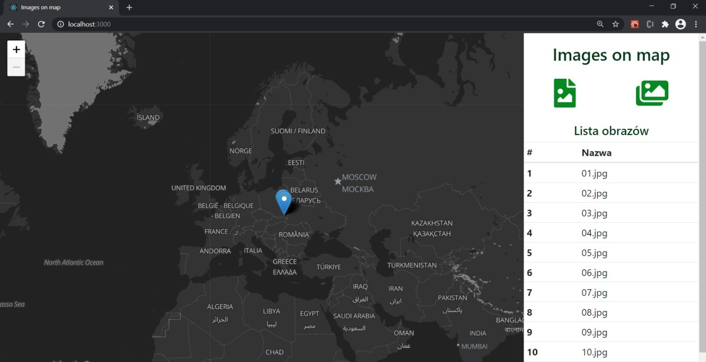
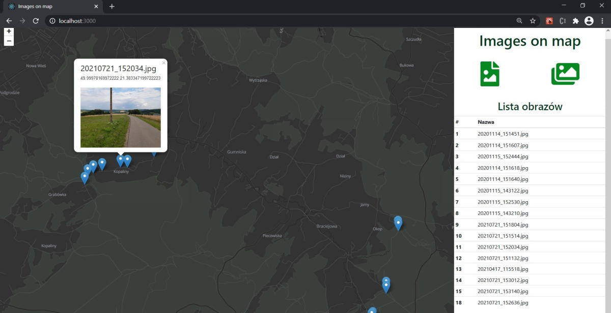

# Images on the Map

The React application loads photos and based on the Exif data presents them on the map.

You can try at https://beskider.github.io/images-on-map/

## Technologies

* [React](https://pl.reactjs.org/)
* [FontAwesome](https://fontawesome.com/)
* [Bootstrap](https://getbootstrap.com/)
* [exif-js](https://github.com/exif-js/exif-js)
* [Leaflet](https://leafletjs.com/)

## Running

```
	$ ./npm start
```

***

# Zdjęcia na mapie

Oparta na bibliotece React aplikacja umożliwiająca ładowanie zdjęć i na podstawie informacji Exif prezentowanie ich na mapie.

Działająca aplikacja pod adresem https://beskider.github.io/images-on-map/

## Użyte technologie

* [React](https://pl.reactjs.org/)
* [FontAwesome](https://fontawesome.com/)
* [Bootstrap](https://getbootstrap.com/)
* [exif-js](https://github.com/exif-js/exif-js)
* [Leaflet](https://leafletjs.com/)

## Uruchamianie

```
	$ ./npm start
```
